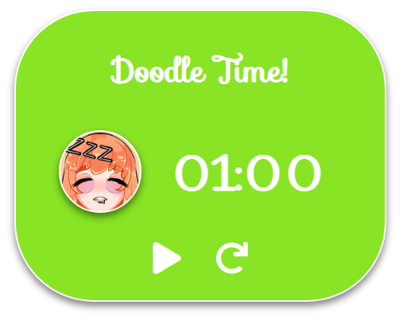

<br />
<p align="center">
  <a href="https://github.com/davidn1998/SleepyTimer">
              
  </a>

  <h3 align="center">Sleepy Doodle Timer</h3>

  <p align="center">
    A timer widget for sleepy's twitch stream.
  </p>
</p>

## About The Project

An interactive timer widget for OBS.



## Installation

1. Clone the repo or download the zip [here](https://github.com/davidn1998/SleepyTimer/archive/main.zip)

   ```sh
   git clone https://github.com/davidn1998/SleepyTimer.git
   ```

2. Store files wherever you wish.

## Set up in OBS

1. Create a browser source in your scene.
   

2. Name your browser source _(ex. SleepyTimer)_
   

3. Setup as seen in image
   ```
   Local file - Checked
   Local file address - Select timer.html
   Width - 500
   Height - 400
   ```
   

## How to use

1. Right-click the timer in Sources and press `Interact`
   

2. Interact with the buttons!
   ```
   1. Change the timer between 1, 2, 3, 4, or 5 mins
   2. Resume/Pause timer
   3. Reset timer
   ```
   
